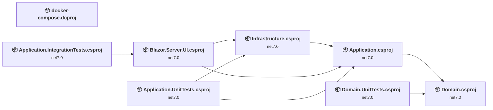
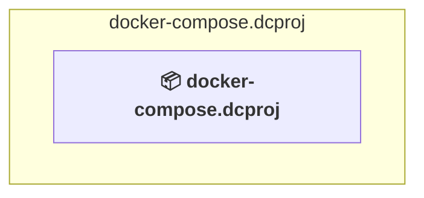
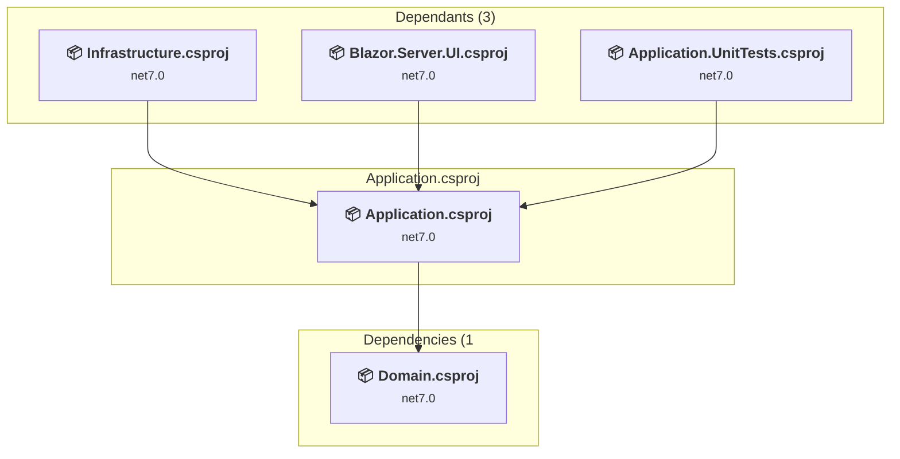
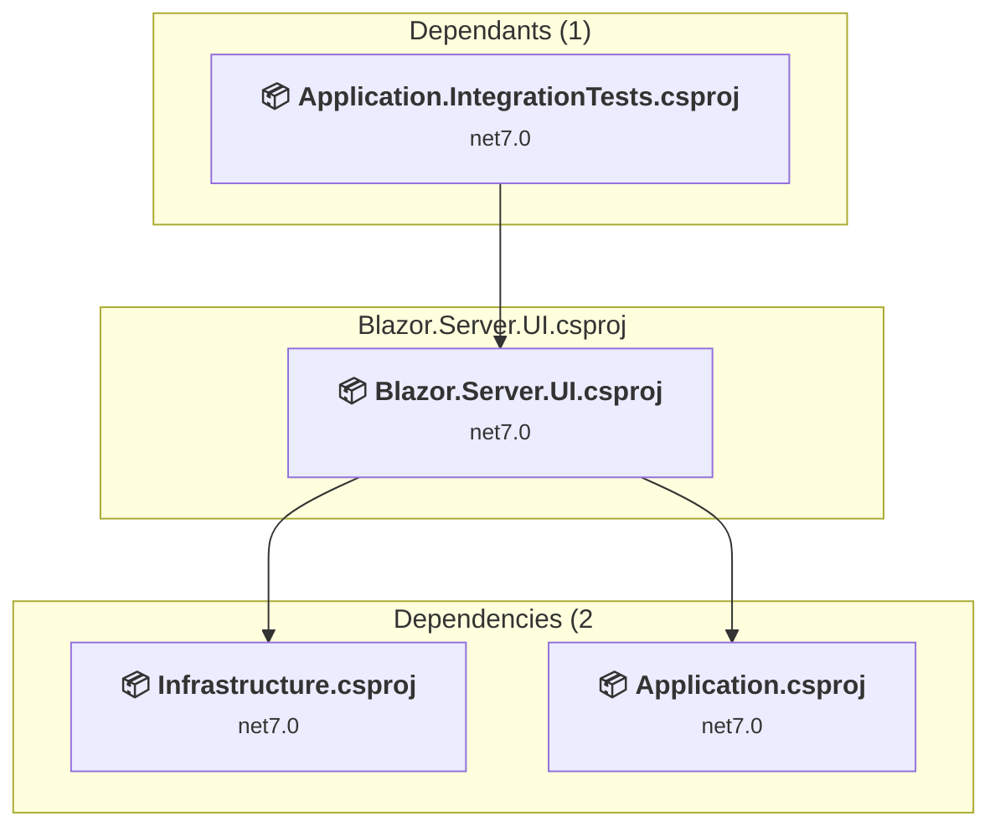
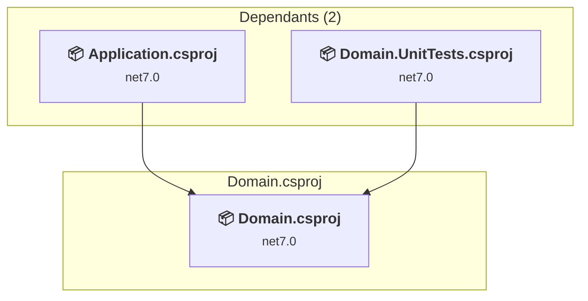
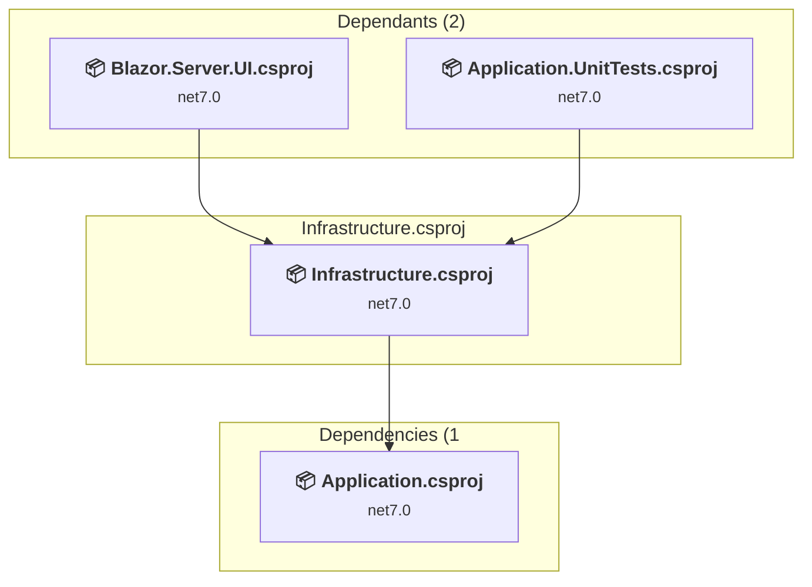
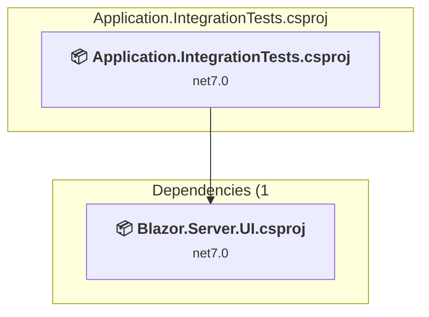
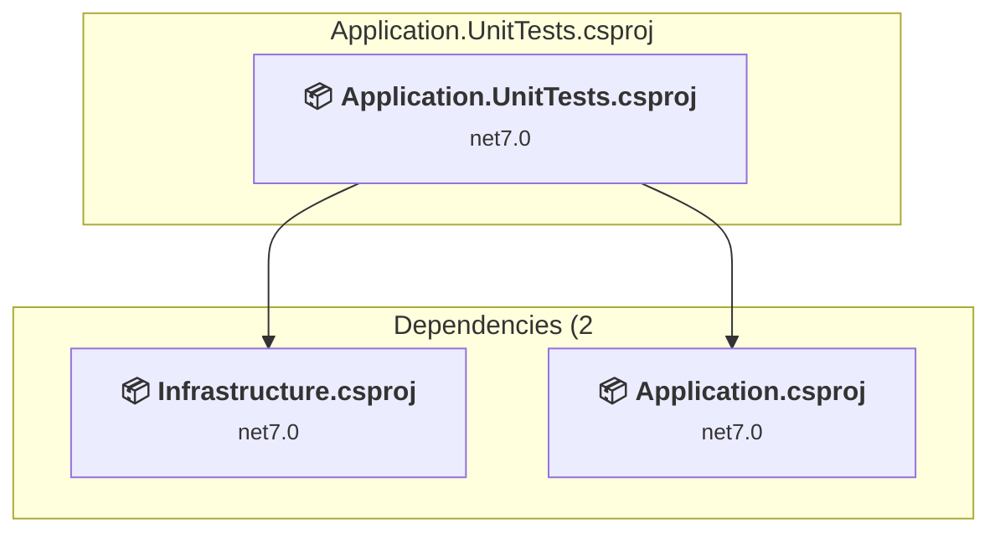
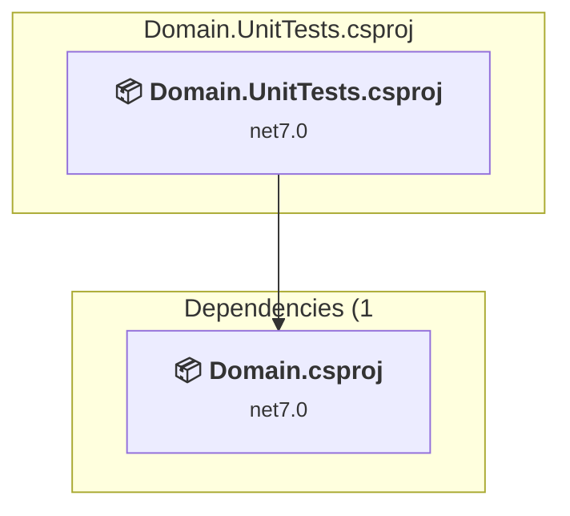

# Projects and dependencies analysis

This document provides a comprehensive overview of the projects and their dependencies in the context of upgrading to .NETCoreApp,Version=v10.0.

## Table of Contents

- [Executive Summary](#executive-Summary)
  - [Highlevel Metrics](#highlevel-metrics)
  - [Projects Compatibility](#projects-compatibility)
  - [Package Compatibility](#package-compatibility)
  - [API Compatibility](#api-compatibility)
  - [Binding Redirect Configuration](#binding-redirect-configuration)
- [Aggregate NuGet packages details](#aggregate-nuget-packages-details)
- [Top API Migration Challenges](#top-api-migration-challenges)
  - [Technologies and Features](#technologies-and-features)
  - [Most Frequent API Issues](#most-frequent-api-issues)
- [Projects Relationship Graph](#projects-relationship-graph)
- [Project Details](#project-details)

  - [docker-compose.dcproj](#docker-composedcproj)
  - [src\Application\Application.csproj](#srcapplicationapplicationcsproj)
  - [src\Blazor.Server.UI\Blazor.Server.UI.csproj](#srcblazorserveruiblazorserveruicsproj)
  - [src\Domain\Domain.csproj](#srcdomaindomaincsproj)
  - [src\Infrastructure\Infrastructure.csproj](#srcinfrastructureinfrastructurecsproj)
  - [tests\Application.IntegrationTests\Application.IntegrationTests.csproj](#testsapplicationintegrationtestsapplicationintegrationtestscsproj)
  - [tests\Application.UnitTests\Application.UnitTests.csproj](#testsapplicationunittestsapplicationunittestscsproj)
  - [tests\Domain.UnitTests\Domain.UnitTests.csproj](#testsdomainunittestsdomainunittestscsproj)

## Executive Summary

### Highlevel Metrics

| Metric | Count | Status |
| :--- | :---: | :--- |
| Total Projects | 8 | 7 require upgrade |
| Total NuGet Packages | 50 | 17 need upgrade |
| Total Code Files | 524 |  |
| Total Code Files with Incidents | 14 |  |
| Total Lines of Code | 46287 |  |
| Total Number of Issues | 63 |  |
| Estimated LOC to modify | 37+ | at least 0,1% of codebase |

### Projects Compatibility

| Project | Target Framework | Difficulty | Package Issues | API Issues | Binding Issues | Est. LOC Impact | Description |
| :--- | :---: | :---: | :---: | :---: | :---: | :---: | :--- |
| [docker-compose.dcproj](#docker-composedcproj) |  | ✅ None | 0 | 0 | 0 |  | DotNetCoreApp, Sdk Style = True |
| [src\Application\Application.csproj](#srcapplicationapplicationcsproj) | net7.0 | 🟢 Low | 7 | 7 | 0 | 7+ | ClassLibrary, Sdk Style = True |
| [src\Blazor.Server.UI\Blazor.Server.UI.csproj](#srcblazorserveruiblazorserveruicsproj) | net7.0 | 🟢 Low | 2 | 9 | 0 | 9+ | AspNetCore, Sdk Style = True |
| [src\Domain\Domain.csproj](#srcdomaindomaincsproj) | net7.0 | 🟢 Low | 1 | 0 | 0 |  | ClassLibrary, Sdk Style = True |
| [src\Infrastructure\Infrastructure.csproj](#srcinfrastructureinfrastructurecsproj) | net7.0 | 🟢 Low | 9 | 20 | 0 | 20+ | ClassLibrary, Sdk Style = True |
| [tests\Application.IntegrationTests\Application.IntegrationTests.csproj](#testsapplicationintegrationtestsapplicationintegrationtestscsproj) | net7.0 | 🟢 Low | 0 | 0 | 0 |  | DotNetCoreApp, Sdk Style = True |
| [tests\Application.UnitTests\Application.UnitTests.csproj](#testsapplicationunittestsapplicationunittestscsproj) | net7.0 | 🟢 Low | 0 | 1 | 0 | 1+ | DotNetCoreApp, Sdk Style = True |
| [tests\Domain.UnitTests\Domain.UnitTests.csproj](#testsdomainunittestsdomainunittestscsproj) | net7.0 | 🟢 Low | 0 | 0 | 0 |  | DotNetCoreApp, Sdk Style = True |

### Package Compatibility

| Status | Count | Percentage |
| :--- | :---: | :---: |
| ✅ Compatible | 33 | 66,0% |
| ⚠️ Incompatible | 1 | 2,0% |
| 🔄 Upgrade Recommended | 16 | 32,0% |
| ***Total NuGet Packages*** | ***50*** | ***100%*** |

### API Compatibility

| Category | Count | Impact |
| :--- | :---: | :--- |
| 🔴 Binary Incompatible | 17 | High - Require code changes |
| 🟡 Source Incompatible | 12 | Medium - Needs re-compilation and potential conflicting API error fixing |
| 🔵 Behavioral change | 8 | Low - Behavioral changes that may require testing at runtime |
| ✅ Compatible | 153171 |  |
| ***Total APIs Analyzed*** | ***153208*** |  |

## Aggregate NuGet packages details

| Package | Current Version | Suggested Version | Projects | Description |
| :--- | :---: | :---: | :--- | :--- |
| AutoMapper | 12.0.1 | 16.1.1 | [Application.csproj](#srcapplicationapplicationcsproj) | NuGet package contains security vulnerability |
| AutoMapper.Extensions.Microsoft.DependencyInjection | 12.0.1 |  | [Application.csproj](#srcapplicationapplicationcsproj) | ⚠️NuGet package is deprecated |
| Blazor-Analytics | 3.12.0 |  | [Blazor.Server.UI.csproj](#srcblazorserveruiblazorserveruicsproj) | ✅Compatible |
| Blazor-ApexCharts | 0.9.21-beta |  | [Blazor.Server.UI.csproj](#srcblazorserveruiblazorserveruicsproj) | ✅Compatible |
| Blazored.LocalStorage | 4.4.0 |  | [Blazor.Server.UI.csproj](#srcblazorserveruiblazorserveruicsproj) | ✅Compatible |
| ClosedXML | 0.102.1 |  | [Infrastructure.csproj](#srcinfrastructureinfrastructurecsproj) | ✅Compatible |
| Duende.IdentityServer | 6.3.3 |  | [Infrastructure.csproj](#srcinfrastructureinfrastructurecsproj) | ✅Compatible |
| Duende.IdentityServer.AspNetIdentity | 6.3.3 |  | [Infrastructure.csproj](#srcinfrastructureinfrastructurecsproj) | ✅Compatible |
| Duende.IdentityServer.EntityFramework | 6.3.3 |  | [Infrastructure.csproj](#srcinfrastructureinfrastructurecsproj) | ✅Compatible |
| Duende.IdentityServer.EntityFramework.Storage | 6.3.3 |  | [Infrastructure.csproj](#srcinfrastructureinfrastructurecsproj) | ✅Compatible |
| Duende.IdentityServer.Storage | 6.3.3 |  | [Infrastructure.csproj](#srcinfrastructureinfrastructurecsproj) | ✅Compatible |
| FluentAssertions | 6.11.0 |  | [Application.IntegrationTests.csproj](#testsapplicationintegrationtestsapplicationintegrationtestscsproj) [Application.UnitTests.csproj](#testsapplicationunittestsapplicationunittestscsproj) [Domain.UnitTests.csproj](#testsdomainunittestsdomainunittestscsproj) | ✅Compatible |
| FluentEmail.Core | 3.0.2 |  | [Application.csproj](#srcapplicationapplicationcsproj) [Infrastructure.csproj](#srcinfrastructureinfrastructurecsproj) | ✅Compatible |
| FluentEmail.MailKit | 3.0.2 |  | [Infrastructure.csproj](#srcinfrastructureinfrastructurecsproj) | ✅Compatible |
| FluentEmail.Razor | 3.0.2 |  | [Application.csproj](#srcapplicationapplicationcsproj) [Infrastructure.csproj](#srcinfrastructureinfrastructurecsproj) | ✅Compatible |
| FluentEmail.Smtp | 3.0.2 |  | [Infrastructure.csproj](#srcinfrastructureinfrastructurecsproj) | ✅Compatible |
| FluentValidation | 11.7.1 |  | [Application.csproj](#srcapplicationapplicationcsproj) | ✅Compatible |
| FluentValidation.DependencyInjectionExtensions | 11.7.1 |  | [Application.csproj](#srcapplicationapplicationcsproj) | ✅Compatible |
| Hangfire.Core | 1.8.5 |  | [Infrastructure.csproj](#srcinfrastructureinfrastructurecsproj) | ✅Compatible |
| hashids.net | 1.7.0 |  | [Infrastructure.csproj](#srcinfrastructureinfrastructurecsproj) | ✅Compatible |
| LazyCache | 2.4.0 |  | [Application.csproj](#srcapplicationapplicationcsproj) | ✅Compatible |
| LazyCache.AspNetCore | 2.4.0 |  | [Application.csproj](#srcapplicationapplicationcsproj) | ✅Compatible |
| MailKit | 4.1.0 | 4.16.0 | [Infrastructure.csproj](#srcinfrastructureinfrastructurecsproj) | NuGet package contains security vulnerability |
| MediatR | 12.1.1 |  | [Application.csproj](#srcapplicationapplicationcsproj) | ✅Compatible |
| Microsoft.AspNetCore.Diagnostics.EntityFrameworkCore | 7.0.10 | 10.0.8 | [Infrastructure.csproj](#srcinfrastructureinfrastructurecsproj) | NuGet package upgrade is recommended |
| Microsoft.AspNetCore.Identity.EntityFrameworkCore | 7.0.10 | 10.0.8 | [Infrastructure.csproj](#srcinfrastructureinfrastructurecsproj) | NuGet package upgrade is recommended |
| Microsoft.AspNetCore.SignalR.Client | 7.0.10 | 10.0.8 | [Application.csproj](#srcapplicationapplicationcsproj) [Infrastructure.csproj](#srcinfrastructureinfrastructurecsproj) | NuGet package upgrade is recommended |
| Microsoft.EntityFrameworkCore | 7.0.10 | 10.0.8 | [Application.csproj](#srcapplicationapplicationcsproj) [Domain.csproj](#srcdomaindomaincsproj) | NuGet package upgrade is recommended |
| Microsoft.EntityFrameworkCore.Design | 7.0.10 | 10.0.8 | [Infrastructure.csproj](#srcinfrastructureinfrastructurecsproj) | NuGet package upgrade is recommended |
| Microsoft.EntityFrameworkCore.InMemory | 7.0.10 | 10.0.8 | [Infrastructure.csproj](#srcinfrastructureinfrastructurecsproj) | NuGet package upgrade is recommended |
| Microsoft.EntityFrameworkCore.SqlServer | 7.0.10 | 10.0.8 | [Infrastructure.csproj](#srcinfrastructureinfrastructurecsproj) | NuGet package upgrade is recommended |
| Microsoft.EntityFrameworkCore.Tools | 7.0.10 | 10.0.8 | [Blazor.Server.UI.csproj](#srcblazorserveruiblazorserveruicsproj) | NuGet package upgrade is recommended |
| Microsoft.Extensions.Configuration.Binder | 7.0.4 | 10.0.8 | [Application.csproj](#srcapplicationapplicationcsproj) | NuGet package upgrade is recommended |
| Microsoft.Extensions.Localization.Abstractions | 7.0.10 | 10.0.8 | [Application.csproj](#srcapplicationapplicationcsproj) | NuGet package upgrade is recommended |
| Microsoft.NET.Test.Sdk | 17.7.1 |  | [Application.IntegrationTests.csproj](#testsapplicationintegrationtestsapplicationintegrationtestscsproj) [Application.UnitTests.csproj](#testsapplicationunittestsapplicationunittestscsproj) [Domain.UnitTests.csproj](#testsdomainunittestsdomainunittestscsproj) | ✅Compatible |
| MimeKit | 4.1.0 | 4.16.0 | [Infrastructure.csproj](#srcinfrastructureinfrastructurecsproj) | NuGet package contains security vulnerability |
| Moq | 4.20.69 |  | [Application.IntegrationTests.csproj](#testsapplicationintegrationtestsapplicationintegrationtestscsproj) [Application.UnitTests.csproj](#testsapplicationunittestsapplicationunittestscsproj) | ✅Compatible |
| MudBlazor | 6.9.0 |  | [Blazor.Server.UI.csproj](#srcblazorserveruiblazorserveruicsproj) | ✅Compatible |
| Net.Codecrete.QrCodeGenerator | 2.0.3 |  | [Infrastructure.csproj](#srcinfrastructureinfrastructurecsproj) | ✅Compatible |
| nunit | 3.13.3 |  | [Application.IntegrationTests.csproj](#testsapplicationintegrationtestsapplicationintegrationtestscsproj) [Application.UnitTests.csproj](#testsapplicationunittestsapplicationunittestscsproj) [Domain.UnitTests.csproj](#testsdomainunittestsdomainunittestscsproj) | ✅Compatible |
| NUnit3TestAdapter | 4.5.0 |  | [Application.IntegrationTests.csproj](#testsapplicationintegrationtestsapplicationintegrationtestscsproj) [Application.UnitTests.csproj](#testsapplicationunittestsapplicationunittestscsproj) [Domain.UnitTests.csproj](#testsdomainunittestsdomainunittestscsproj) | ✅Compatible |
| Respawn | 6.1.0 |  | [Application.IntegrationTests.csproj](#testsapplicationintegrationtestsapplicationintegrationtestscsproj) | ✅Compatible |
| Serilog.AspNetCore | 7.0.0 |  | [Infrastructure.csproj](#srcinfrastructureinfrastructurecsproj) | ✅Compatible |
| Serilog.Enrichers.ClientInfo | 2.0.0 | 2.9.0 | [Infrastructure.csproj](#srcinfrastructureinfrastructurecsproj) | NuGet package contains security vulnerability |
| Serilog.Sinks.Console | 4.1.0 |  | [Infrastructure.csproj](#srcinfrastructureinfrastructurecsproj) | ✅Compatible |
| Serilog.Sinks.MSSqlServer | 6.3.0 |  | [Infrastructure.csproj](#srcinfrastructureinfrastructurecsproj) | ✅Compatible |
| SixLabors.ImageSharp | 3.0.1 | 4.0.0 | [Blazor.Server.UI.csproj](#srcblazorserveruiblazorserveruicsproj) | NuGet package contains security vulnerability |
| SixLabors.ImageSharp.Drawing | 1.0.0 |  | [Blazor.Server.UI.csproj](#srcblazorserveruiblazorserveruicsproj) | ✅Compatible |
| System.Linq.Dynamic.Core | 1.3.4 | 1.7.2 | [Application.csproj](#srcapplicationapplicationcsproj) | NuGet package contains security vulnerability |
| Toolbelt.Blazor.HotKeys2 | 1.0.0 |  | [Blazor.Server.UI.csproj](#srcblazorserveruiblazorserveruicsproj) | ✅Compatible |

## Top API Migration Challenges

### Technologies and Features

| Technology | Issues | Percentage | Migration Path |
| :--- | :---: | :---: | :--- |
| IdentityModel & Claims-based Security | 11 | 29,7% | Windows Identity Foundation (WIF), SAML, and claims-based authentication APIs that have been replaced by modern identity libraries. WIF was the original identity framework for .NET Framework. Migrate to Microsoft.IdentityModel.* packages (modern identity stack). |

### Most Frequent API Issues

| API | Count | Percentage | Category |
| :--- | :---: | :---: | :--- |
| M:System.TimeSpan.FromSeconds(System.Double) | 3 | 8,1% | Source Incompatible |
| M:System.TimeSpan.FromMinutes(System.Double) | 3 | 8,1% | Source Incompatible |
| M:Microsoft.Extensions.DependencyInjection.OptionsConfigurationServiceCollectionExtensions.Configure''1(Microsoft.Extensions.DependencyInjection.IServiceCollection,Microsoft.Extensions.Configuration.IConfiguration) | 3 | 8,1% | Binary Incompatible |
| T:System.Net.Http.HttpContent | 2 | 5,4% | Behavioral Change |
| T:System.Text.Json.JsonDocument | 2 | 5,4% | Behavioral Change |
| T:Microsoft.Extensions.DependencyInjection.ServiceCollectionExtensions | 2 | 5,4% | Binary Incompatible |
| T:System.Uri | 2 | 5,4% | Behavioral Change |
| T:System.IdentityModel.Tokens.Jwt.JwtSecurityTokenHandler | 2 | 5,4% | Binary Incompatible |
| M:System.IdentityModel.Tokens.Jwt.JwtSecurityTokenHandler.#ctor | 2 | 5,4% | Binary Incompatible |
| T:System.Net.ServicePointManager | 1 | 2,7% | Source Incompatible |
| T:System.Runtime.Serialization.FormatterServices | 1 | 2,7% | Source Incompatible |
| M:Microsoft.AspNetCore.Builder.ExceptionHandlerExtensions.UseExceptionHandler(Microsoft.AspNetCore.Builder.IApplicationBuilder,System.String) | 1 | 2,7% | Behavioral Change |
| M:System.Uri.#ctor(System.String) | 1 | 2,7% | Behavioral Change |
| T:System.IdentityModel.Tokens.Jwt.JwtHeader | 1 | 2,7% | Binary Incompatible |
| P:System.IdentityModel.Tokens.Jwt.JwtSecurityToken.Header | 1 | 2,7% | Binary Incompatible |
| P:System.IdentityModel.Tokens.Jwt.JwtHeader.Alg | 1 | 2,7% | Binary Incompatible |
| M:System.IdentityModel.Tokens.Jwt.JwtSecurityTokenHandler.ValidateToken(System.String,Microsoft.IdentityModel.Tokens.TokenValidationParameters,Microsoft.IdentityModel.Tokens.SecurityToken@) | 1 | 2,7% | Binary Incompatible |
| M:System.IdentityModel.Tokens.Jwt.JwtSecurityTokenHandler.WriteToken(Microsoft.IdentityModel.Tokens.SecurityToken) | 1 | 2,7% | Binary Incompatible |
| T:System.IdentityModel.Tokens.Jwt.JwtSecurityToken | 1 | 2,7% | Binary Incompatible |
| M:System.IdentityModel.Tokens.Jwt.JwtSecurityToken.#ctor(System.String,System.String,System.Collections.Generic.IEnumerable{System.Security.Claims.Claim},System.Nullable{System.DateTime},System.Nullable{System.DateTime},Microsoft.IdentityModel.Tokens.SigningCredentials) | 1 | 2,7% | Binary Incompatible |
| T:Microsoft.Extensions.DependencyInjection.IdentityEntityFrameworkBuilderExtensions | 1 | 2,7% | Source Incompatible |
| M:Microsoft.Extensions.DependencyInjection.IdentityEntityFrameworkBuilderExtensions.AddEntityFrameworkStores''1(Microsoft.AspNetCore.Identity.IdentityBuilder) | 1 | 2,7% | Source Incompatible |
| T:Microsoft.Extensions.DependencyInjection.DatabaseDeveloperPageExceptionFilterServiceExtensions | 1 | 2,7% | Source Incompatible |
| M:Microsoft.Extensions.DependencyInjection.DatabaseDeveloperPageExceptionFilterServiceExtensions.AddDatabaseDeveloperPageExceptionFilter(Microsoft.Extensions.DependencyInjection.IServiceCollection) | 1 | 2,7% | Source Incompatible |
| M:Microsoft.Extensions.Configuration.ConfigurationBinder.GetValue''1(Microsoft.Extensions.Configuration.IConfiguration,System.String) | 1 | 2,7% | Binary Incompatible |

## Projects Relationship Graph

Legend:
📦 SDK-style project
⚙️ Classic project

## Project Details

### docker-compose.dcproj

#### Project Info

- **Current Target Framework:** ✅
- **SDK-style**: True
- **Project Kind:** DotNetCoreApp
- **Dependencies**: 0
- **Dependants**: 0
- **Number of Files**: 0
- **Lines of Code**: 0
- **Estimated LOC to modify**: 0+ (at least 0,0% of the project)

#### Dependency Graph

Legend:
📦 SDK-style project
⚙️ Classic project

### API Compatibility

| Category | Count | Impact |
| :--- | :---: | :--- |
| 🔴 Binary Incompatible | 0 | High - Require code changes |
| 🟡 Source Incompatible | 0 | Medium - Needs re-compilation and potential conflicting API error fixing |
| 🔵 Behavioral change | 0 | Low - Behavioral changes that may require testing at runtime |
| ✅ Compatible | 0 |  |
| ***Total APIs Analyzed*** | ***0*** |  |

### src\Application\Application.csproj

#### Project Info

- **Current Target Framework:** net7.0
- **Proposed Target Framework:** net10.0
- **SDK-style**: True
- **Project Kind:** ClassLibrary
- **Dependencies**: 1
- **Dependants**: 3
- **Number of Files**: 398
- **Number of Files with Incidents**: 4
- **Lines of Code**: 12732
- **Estimated LOC to modify**: 7+ (at least 0,1% of the project)

#### Dependency Graph

Legend:
📦 SDK-style project
⚙️ Classic project

### API Compatibility

| Category | Count | Impact |
| :--- | :---: | :--- |
| 🔴 Binary Incompatible | 2 | High - Require code changes |
| 🟡 Source Incompatible | 1 | Medium - Needs re-compilation and potential conflicting API error fixing |
| 🔵 Behavioral change | 4 | Low - Behavioral changes that may require testing at runtime |
| ✅ Compatible | 24537 |  |
| ***Total APIs Analyzed*** | ***24544*** |  |

### src\Blazor.Server.UI\Blazor.Server.UI.csproj

#### Project Info

- **Current Target Framework:** net7.0
- **Proposed Target Framework:** net10.0
- **SDK-style**: True
- **Project Kind:** AspNetCore
- **Dependencies**: 2
- **Dependants**: 1
- **Number of Files**: 238
- **Number of Files with Incidents**: 2
- **Lines of Code**: 3123
- **Estimated LOC to modify**: 9+ (at least 0,3% of the project)

#### Dependency Graph

Legend:
📦 SDK-style project
⚙️ Classic project

### API Compatibility

| Category | Count | Impact |
| :--- | :---: | :--- |
| 🔴 Binary Incompatible | 0 | High - Require code changes |
| 🟡 Source Incompatible | 5 | Medium - Needs re-compilation and potential conflicting API error fixing |
| 🔵 Behavioral change | 4 | Low - Behavioral changes that may require testing at runtime |
| ✅ Compatible | 81591 |  |
| ***Total APIs Analyzed*** | ***81600*** |  |

### src\Domain\Domain.csproj

#### Project Info

- **Current Target Framework:** net7.0
- **Proposed Target Framework:** net10.0
- **SDK-style**: True
- **Project Kind:** ClassLibrary
- **Dependencies**: 0
- **Dependants**: 2
- **Number of Files**: 68
- **Number of Files with Incidents**: 1
- **Lines of Code**: 1257
- **Estimated LOC to modify**: 0+ (at least 0,0% of the project)

#### Dependency Graph

Legend:
📦 SDK-style project
⚙️ Classic project

### API Compatibility

| Category | Count | Impact |
| :--- | :---: | :--- |
| 🔴 Binary Incompatible | 0 | High - Require code changes |
| 🟡 Source Incompatible | 0 | Medium - Needs re-compilation and potential conflicting API error fixing |
| 🔵 Behavioral change | 0 | Low - Behavioral changes that may require testing at runtime |
| ✅ Compatible | 2295 |  |
| ***Total APIs Analyzed*** | ***2295*** |  |

### src\Infrastructure\Infrastructure.csproj

#### Project Info

- **Current Target Framework:** net7.0
- **Proposed Target Framework:** net10.0
- **SDK-style**: True
- **Project Kind:** ClassLibrary
- **Dependencies**: 1
- **Dependants**: 2
- **Number of Files**: 99
- **Number of Files with Incidents**: 3
- **Lines of Code**: 28612
- **Estimated LOC to modify**: 20+ (at least 0,1% of the project)

#### Dependency Graph

Legend:
📦 SDK-style project
⚙️ Classic project

### API Compatibility

| Category | Count | Impact |
| :--- | :---: | :--- |
| 🔴 Binary Incompatible | 15 | High - Require code changes |
| 🟡 Source Incompatible | 5 | Medium - Needs re-compilation and potential conflicting API error fixing |
| 🔵 Behavioral change | 0 | Low - Behavioral changes that may require testing at runtime |
| ✅ Compatible | 43956 |  |
| ***Total APIs Analyzed*** | ***43976*** |  |

#### Project Technologies and Features

| Technology | Issues | Percentage | Migration Path |
| :--- | :---: | :---: | :--- |
| IdentityModel & Claims-based Security | 11 | 55,0% | Windows Identity Foundation (WIF), SAML, and claims-based authentication APIs that have been replaced by modern identity libraries. WIF was the original identity framework for .NET Framework. Migrate to Microsoft.IdentityModel.* packages (modern identity stack). |

### tests\Application.IntegrationTests\Application.IntegrationTests.csproj

#### Project Info

- **Current Target Framework:** net7.0
- **Proposed Target Framework:** net10.0
- **SDK-style**: True
- **Project Kind:** DotNetCoreApp
- **Dependencies**: 1
- **Dependants**: 0
- **Number of Files**: 9
- **Number of Files with Incidents**: 1
- **Lines of Code**: 360
- **Estimated LOC to modify**: 0+ (at least 0,0% of the project)

#### Dependency Graph

Legend:
📦 SDK-style project
⚙️ Classic project

### API Compatibility

| Category | Count | Impact |
| :--- | :---: | :--- |
| 🔴 Binary Incompatible | 0 | High - Require code changes |
| 🟡 Source Incompatible | 0 | Medium - Needs re-compilation and potential conflicting API error fixing |
| 🔵 Behavioral change | 0 | Low - Behavioral changes that may require testing at runtime |
| ✅ Compatible | 506 |  |
| ***Total APIs Analyzed*** | ***506*** |  |

### tests\Application.UnitTests\Application.UnitTests.csproj

#### Project Info

- **Current Target Framework:** net7.0
- **Proposed Target Framework:** net10.0
- **SDK-style**: True
- **Project Kind:** DotNetCoreApp
- **Dependencies**: 2
- **Dependants**: 0
- **Number of Files**: 5
- **Number of Files with Incidents**: 2
- **Lines of Code**: 149
- **Estimated LOC to modify**: 1+ (at least 0,7% of the project)

#### Dependency Graph

Legend:
📦 SDK-style project
⚙️ Classic project

### API Compatibility

| Category | Count | Impact |
| :--- | :---: | :--- |
| 🔴 Binary Incompatible | 0 | High - Require code changes |
| 🟡 Source Incompatible | 1 | Medium - Needs re-compilation and potential conflicting API error fixing |
| 🔵 Behavioral change | 0 | Low - Behavioral changes that may require testing at runtime |
| ✅ Compatible | 213 |  |
| ***Total APIs Analyzed*** | ***214*** |  |

### tests\Domain.UnitTests\Domain.UnitTests.csproj

#### Project Info

- **Current Target Framework:** net7.0
- **Proposed Target Framework:** net10.0
- **SDK-style**: True
- **Project Kind:** DotNetCoreApp
- **Dependencies**: 1
- **Dependants**: 0
- **Number of Files**: 3
- **Number of Files with Incidents**: 1
- **Lines of Code**: 54
- **Estimated LOC to modify**: 0+ (at least 0,0% of the project)

#### Dependency Graph

Legend:
📦 SDK-style project
⚙️ Classic project

### API Compatibility

| Category | Count | Impact |
| :--- | :---: | :--- |
| 🔴 Binary Incompatible | 0 | High - Require code changes |
| 🟡 Source Incompatible | 0 | Medium - Needs re-compilation and potential conflicting API error fixing |
| 🔵 Behavioral change | 0 | Low - Behavioral changes that may require testing at runtime |
| ✅ Compatible | 73 |  |
| ***Total APIs Analyzed*** | ***73*** |  |

